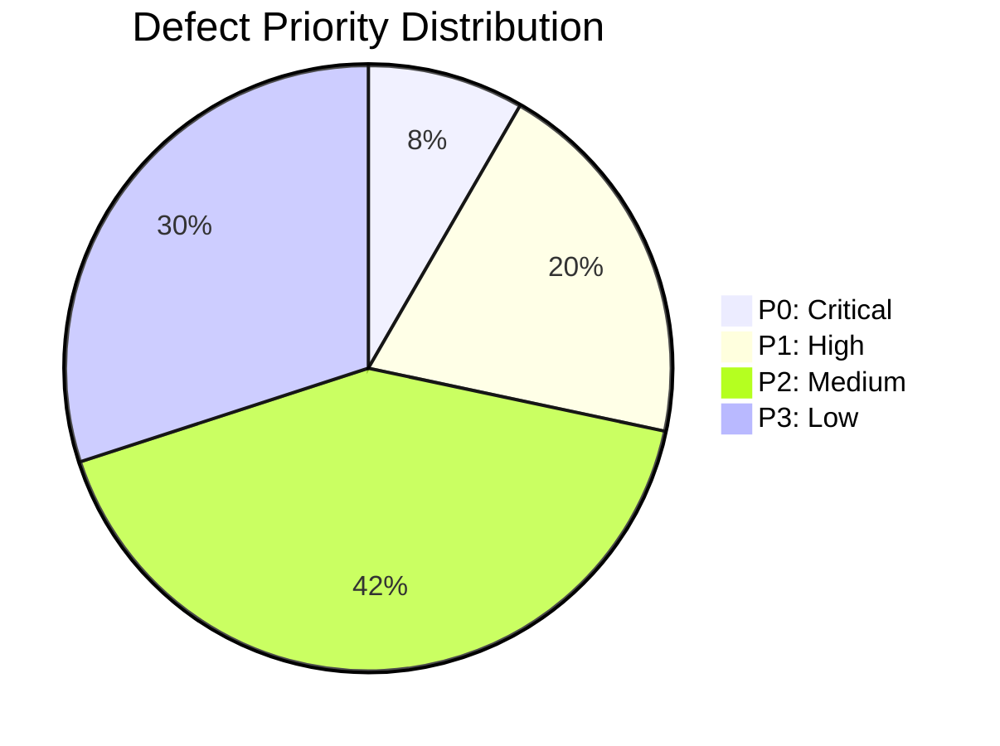
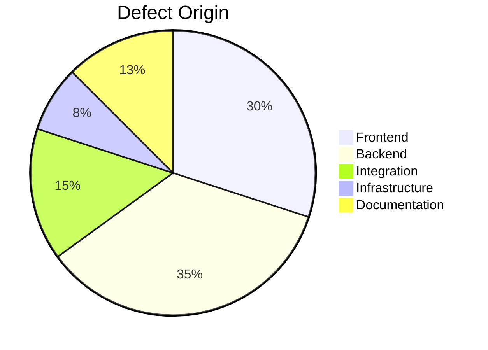
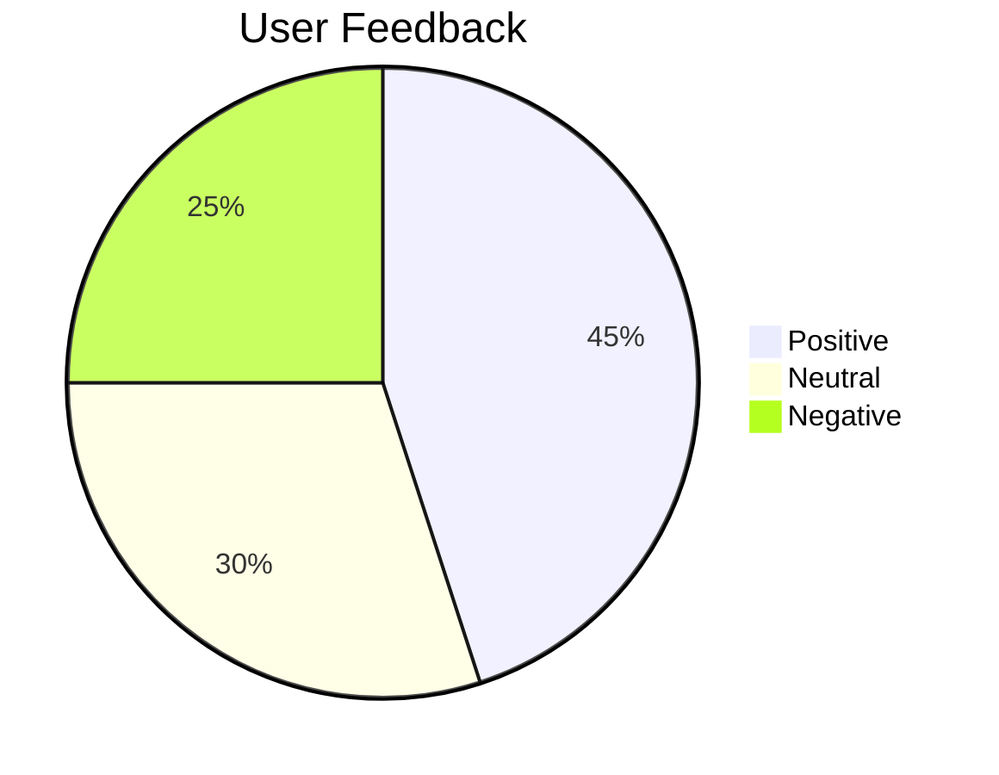
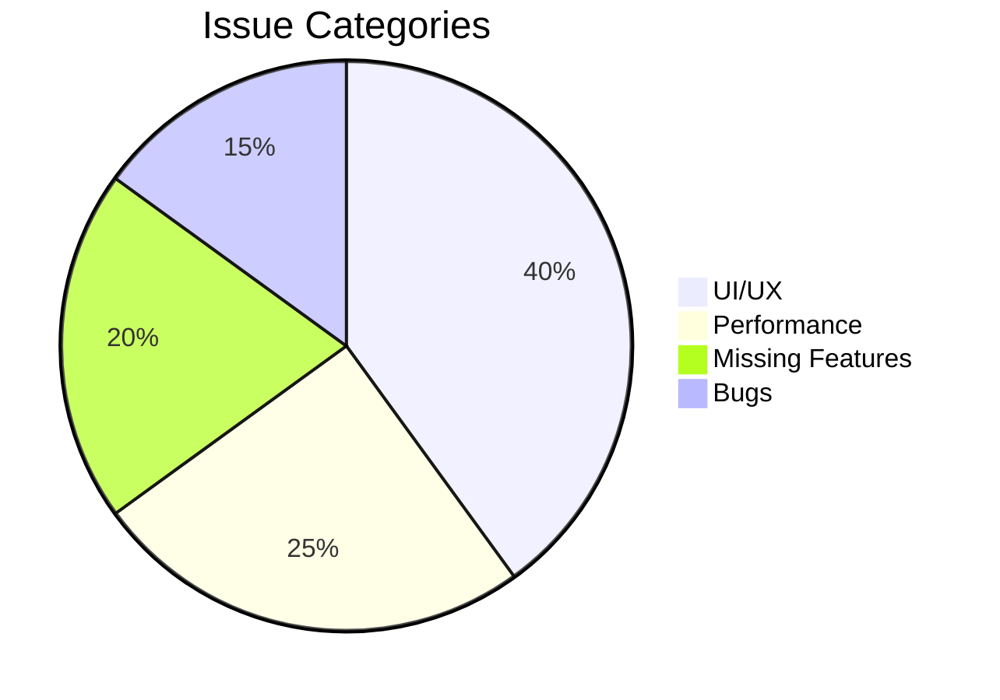

# Quality Metrics Framework

Strategic approach to defining, collecting, and acting on software quality metrics that drive continuous improvement and business value.

## Quality KPIs and Metrics

### Defect Management Metrics

```markdown
# Defect Management Dashboard

## Key Metrics

| Metric | Formula | Target | Current | Status |
|--------|---------|--------|---------|--------|
| Defect Density | Total Defects / KLOC | ≤ 1.0 | 0.8 | ✅ | |
| Critical Defect Resolution Time | Avg. time to resolve P0/P1 defects | ≤ 4h | 3.2h | ✅ |
| Defect Reopen Rate | Reopened Defects / Total Resolved | ≤ 5% | 3.8% | ✅ |
| Test Escape Rate | Production Defects / Total Defects | ≤ 10% | 8.5% | ✅ |
| Defect Turnaround Time | Avg. time from report to resolution | ≤ 24h | 18.5h | ✅ |

## Defect Trends (Last 8 Weeks)

```mermaid
lineChart
    title Defect Trends
    x-axis Week
    y-axis Count
    series Reported, Resolved
    Reported : 45, 38, 42, 36, 39, 33, 30, 28
    Resolved : 32, 41, 39, 40, 37, 35, 34, 31
```

## Defect Distribution





## Action Items

- Investigate increase in P1 defects from integration points
- Review test coverage for backend components with highest defect density
- Conduct root cause analysis for reopened defects
```

### Test Coverage Metrics

```markdown
# Test Coverage Dashboard

## Coverage Summary

| Component | Unit Coverage | Integration Coverage | E2E Coverage | Total Coverage |
|-----------|---------------|----------------------|--------------|----------------|
| Authentication | 98% | 95% | 100% | 97.7% |
| Payment Processing | 95% | 92% | 100% | 95.7% |
| User Management | 92% | 88% | 95% | 91.7% |
| Reporting | 85% | 80% | 90% | 85.0% |
| API Gateway | 90% | 85% | 95% | 90.0% |
| Overall | 92% | 88% | 96% | 92.0% |

## Coverage Trends (Last 6 Months)

```mermaid
lineChart
    title Test Coverage Trends
    x-axis Month
    y-axis Percentage
    series Unit, Integration, E2E, Overall
    Unit : 88, 89, 90, 91, 91.5, 92
    Integration : 82, 83, 84, 86, 87, 88
    E2E : 90, 91, 92, 93, 94, 96
    Overall : 86.7, 87.7, 88.7, 89.7, 90.2, 92.0
```

## Gaps Analysis

### Low Coverage Areas

1. **Error Handling Paths** (Current: 65%)
   - Missing negative test cases for edge conditions
   - Insufficient validation of malformed inputs
   - Limited testing of third-party service failures

2. **Concurrent Operations** (Current: 70%)
   - Race condition scenarios not adequately tested
   - Limited stress testing for high-concurrency scenarios
   - Incomplete testing of distributed locking mechanisms

3. **Security Controls** (Current: 75%)
   - Authentication bypass scenarios missing
   - Insufficient authorization testing for role transitions
   - Limited testing of CSRF and XSRF protections

## Action Plan

| Initiative | Owner | Target Date | Status |
|-----------|-------|-------------|--------|
| Implement mutation testing | QA Lead | 2025-06-30 | In Progress |
| Expand negative test suite | Test Engineer | 2025-05-15 | Planned |
| Add concurrency stress tests | SDET | 2025-07-31 | Research |
| Enhance security test coverage | Security Engineer | 2025-06-15 | Planned |
```

### Release Quality Metrics

```markdown
# Release Quality Dashboard

## Release Metrics

| Release | Version | UAT Defects | P0/P1 in Prod | Rollback | Business Impact | Quality Score |
|---------|---------|-------------|---------------|----------|----------------|---------------|
| 2025-03-15 | 2.3.1 | 5 | 0 | No | Minimal | 9.2/10 |
| 2025-02-28 | 2.3.0 | 12 | 1 | No | Low | 8.1/10 |
| 2025-02-10 | 2.2.5 | 8 | 2 | Yes | Medium | 6.5/10 |
| 2025-01-25 | 2.2.4 | 6 | 0 | No | Minimal | 9.0/10 |
| 2025-01-05 | 2.2.3 | 15 | 3 | Yes | High | 5.8/10 |

## Deployment Success Rate

```mermaid
lineChart
    title Deployment Success Rate
    x-axis Week
    y-axis Percentage
    series Success Rate
    Success Rate : 100, 100, 85, 100, 70, 100, 100, 100
```

## Post-Deployment Monitoring

### Performance Impact

| Metric | Pre-Release | Post-Release | Delta | Status |
|--------|-------------|--------------|-------|--------|
| API Response Time | 215ms | 228ms | +13ms | ⚠️ |
| Error Rate | 0.45% | 0.52% | +0.07% | ⚠️ |
| Throughput | 1,240 req/s | 1,180 req/s | -60 req/s | ⚠️ |
| Cache Hit Rate | 92.3% | 91.8% | -0.5% | ✅ |

### Business Impact





## Release Process Improvements

1. **Enhanced Pre-Release Checklist**
   - Add performance regression gates
   - Implement security scan requirements
   - Require test coverage minimums

2. **Improved Rollback Procedures**
   - Automate rollback triggers based on health checks
   - Implement blue-green deployment strategy
   - Add database migration rollback plans

3. **Post-Mortem Process**
   - Conduct blameless post-mortems for failed releases
   - Track action items to resolution
   - Share learnings across teams
```

## Metrics Collection Framework

### Automated Metrics Pipeline

```yaml
# .github/workflows/quality-metrics.yml
name: Quality Metrics Collection

on:
  schedule:
    - cron: '0 2 * * 1'  # Run every Monday at 2 AM
  workflow_dispatch:

jobs:
  collect-metrics:
    runs-on: ubuntu-latest

    steps:
    - uses: actions/checkout@v4
    
    - name: Setup Node.js
      uses: actions/setup-node@v4
      with:
        node-version: '18'
        cache: 'npm'

    - name: Install dependencies
      run: npm ci

    - name: Extract test results
      run: |
        # Collect JUnit test results
        mkdir -p metrics/test-results
        find . -name "TEST-*.xml" -exec cp {} metrics/test-results/ \; 2>/dev/null || true
        
        # Generate coverage report
        npm run test:coverage -- --output-file=metrics/coverage.json

    - name: Run static analysis
      run: |
        # Run ESLint and generate report
        npx eslint . --format=json --output-file=metrics/eslint.json
        
        # Run SonarQube scanner
        npx sonarqube-scanner

    - name: Collect CI/CD metrics
      run: |
        # Get recent pipeline data
        gh api 
          -X GET
          -H "Accept: application/vnd.github.v3+json"
          "/repos/${{ github.repository }}/actions/runs?per_page=100"
          > metrics/pipeline_runs.json
        
        # Get deployment data
        gh api 
          -X GET
          -H "Accept: application/vnd.github.v3+json"
          "/repos/${{ github.repository }}/deployments?per_page=100"
          > metrics/deployments.json

    - name: Generate quality dashboard
      run: |
        # Run metrics processing script
        node scripts/generate-quality-dashboard.js
        
        # Update README with latest metrics
        node scripts/update-readme-metrics.js

    - name: Commit and push updates
      run: |
        git config user.name 'github-actions'
        git config user.email 'github-actions@github.com'
        
        # Only commit if there are changes
        if [ -n "$(git status --porcelain)" ]; then
          git add .
          git commit -m "[automated] Update quality metrics $(date +%Y-%m-%d)"
          git push
        fi
```

### Metrics Processing Script

```javascript
// scripts/generate-quality-dashboard.js
const fs = require('fs');
const path = require('path');
const axios = require('axios');
const jsYaml = require('js-yaml');

// Configuration
const CONFIG = {
  metricsPath: './metrics',
  outputPath: './docs/dashboards',
  services: {
    sonarqube: 'https://sonarqube.example.com',
    jenkins: 'https://jenkins.example.com',
    datadog: 'https://api.datadoghq.com'
  }
};

class MetricsProcessor {
  constructor() {
    this.metrics = {
      test: {},
      coverage: {},
      defects: {},
      performance: {},
      ci_cd: {}
    };
  }

  async processAllMetrics() {
    console.log('Starting metrics processing...');
    
    try {
      // Load raw data
      await this.loadTestData();
      await this.loadCoverageData();
      await this.loadDefectData();
      await this.loadPerformanceData();
      await this.loadCiCdData();
      
      // Calculate KPIs
      this.calculateTestKpis();
      this.calculateCoverageKpis();
      this.calculateDefectKpis();
      this.calculatePerformanceKpis();
      this.calculateCiCdKpis();
      
      // Generate dashboards
      await this.generateDashboards();
      
      // Save processed metrics
      this.saveProcessedMetrics();
      
      console.log('Metrics processing completed successfully');
      
    } catch (error) {
      console.error('Error processing metrics:', error);
      throw error;
    }
  }

  async loadTestData() {
    console.log('Loading test data...');
    
    const testResultsPath = path.join(CONFIG.metricsPath, 'test-results');
    const testFiles = fs.readdirSync(testResultsPath);
    
    const testResults = [];
    for (const file of testFiles) {
      if (file.endsWith('.xml')) {
        const content = fs.readFileSync(path.join(testResultsPath, file), 'utf8');
        const parsed = this.parseJUnitXml(content);
        testResults.push(...parsed.testsuites[0].testcase);
      }
    }
    
    this.metrics.test.raw = testResults;
  }

  async loadCoverageData() {
    console.log('Loading coverage data...');
    
    const coveragePath = path.join(CONFIG.metricsPath, 'coverage.json');
    if (fs.existsSync(coveragePath)) {
      const coverageData = JSON.parse(fs.readFileSync(coveragePath, 'utf8'));
      this.metrics.coverage.raw = coverageData;
    }
  }

  async loadDefectData() {
    console.log('Loading defect data...');
    
    // Fetch from Jira or other issue tracking system
    try {
      const response = await axios.get(
        `${CONFIG.services.jira}/rest/api/3/search`,
        {
          params: {
            jql: 'project=QUALITY AND created >= -8w ORDER BY created DESC',
            fields: 'summary,status,priority,created,updated'
          },
          headers: {
            'Authorization': `Basic ${Buffer.from(process.env.JIRA_USER + ':' + process.env.JIRA_TOKEN).toString('base64')}`
          }
        }
      );
      
      this.metrics.defects.raw = response.data.issues;
      
    } catch (error) {
      console.warn('Could not fetch defect data:', error.message);
      // Use fallback data
      this.metrics.defects.raw = this.loadLocalDefectData();
    }
  }

  loadLocalDefectData() {
    // Load from local file if Jira is unavailable
    const localPath = path.join(CONFIG.metricsPath, 'local-defects.json');
    if (fs.existsSync(localPath)) {
      return JSON.parse(fs.readFileSync(localPath, 'utf8'));
    }
    return [];
  }

  async loadPerformanceData() {
    console.log('Loading performance data...');
    
    // Fetch from monitoring system
    try {
      const [responseTime, errorRate, throughput] = await Promise.all([
        axios.get(`${CONFIG.services.datadog}/api/v1/metrics/query`, {
          params: {
            query: 'avg:api.response.time{env:production}.as_rate()'
          },
          headers: {
            'DD-API-KEY': process.env.DATADOG_API_KEY
          }
        }),
        axios.get(`${CONFIG.services.datadog}/api/v1/metrics/query`, {
          params: {
            query: 'avg:api.error.rate{env:production}.as_rate()'
          },
          headers: {
            'DD-API-KEY': process.env.DATADOG_API_KEY
          }
        }),
        axios.get(`${CONFIG.services.datadog}/api/v1/metrics/query`, {
          params: {
            query: 'avg:api.throughput{env:production}.as_rate()'
          },
          headers: {
            'DD-API-KEY': process.env.DATADOG_API_KEY
          }
        })
      ]);
      
      this.metrics.performance.response_time = responseTime.data;
      this.metrics.performance.error_rate = errorRate.data;
      this.metrics.performance.throughput = throughput.data;
      
    } catch (error) {
      console.warn('Could not fetch performance data:', error.message);
    }
  }

  async loadCiCdData() {
    console.log('Loading CI/CD data...');
    
    const pipelineRunsPath = path.join(CONFIG.metricsPath, 'pipeline_runs.json');
    const deploymentsPath = path.join(CONFIG.metricsPath, 'deployments.json');
    
    if (fs.existsSync(pipelineRunsPath)) {
      this.metrics.ci_cd.pipeline_runs = JSON.parse(
        fs.readFileSync(pipelineRunsPath, 'utf8')
      );
    }
    
    if (fs.existsSync(deploymentsPath)) {
      this.metrics.ci_cd.deployments = JSON.parse(
        fs.readFileSync(deploymentsPath, 'utf8')
      );
    }
  }

  calculateTestKpis() {
    console.log('Calculating test KPIs...');
    
    const tests = this.metrics.test.raw;
    
    this.metrics.test.kpis = {
      total_tests: tests.length,
      passed: tests.filter(t => !t.failure && !t.error).length,
      failed: tests.filter(t => t.failure || t.error).length,
      skipped: tests.filter(t => t.$.status === 'skipped').length,
      pass_rate: 0,
      average_duration: 0
    };
    
    // Calculate pass rate
    this.metrics.test.kpis.pass_rate = 
      parseFloat(((this.metrics.test.kpis.passed / tests.length) * 100).toFixed(2));
    
    // Calculate average duration
    const durations = tests.map(t => parseFloat(t.$.time) || 0);
    this.metrics.test.kpis.average_duration = 
      parseFloat((durations.reduce((a, b) => a + b, 0) / durations.length).toFixed(3));
    
    // Failure trends
    this.metrics.test.kpis.failure_trends = this.calculateTrendData(
      tests, 'day', (t) => new Date(t.$.timestamp || t.$.time).toISOString().split('T')[0]
    );
  }

  calculateCoverageKpis() {
    console.log('Calculating coverage KPIs...');
    
    const raw = this.metrics.coverage.raw;
    
    if (raw && raw.total) {
      const total = raw.total;
      
      this.metrics.coverage.kpis = {
        lines: {
          covered: total.lines.covered,
          total: total.lines.total,
          percentage: parseFloat(((total.lines.covered / total.lines.total) * 100).toFixed(2))
        },
        statements: {
          covered: total.statements.covered,
          total: total.statements.total,
          percentage: parseFloat(((total.statements.covered / total.statements.total) * 100).toFixed(2))
        },
        functions: {
          covered: total.functions.covered,
          total: total.functions.total,
          percentage: parseFloat(((total.functions.covered / total.functions.total) * 100).toFixed(2))
        },
        branches: {
          covered: total.branches.covered,
          total: total.branches.total,
          percentage: parseFloat(((total.branches.covered / total.branches.total) * 100).toFixed(2))
        }
      };
    }
  }

  calculateDefectKpis() {
    console.log('Calculating defect KPIs...');
    
    const defects = this.metrics.defects.raw;
    const now = new Date();
    
    // Filter recent defects
    const recentDefects = defects.filter(d => 
      new Date(d.fields.created) > new Date(now.getTime() - 8 * 7 * 24 * 60 * 60 * 1000)
    );
    
    // Count by priority
    const priorityCounts = this.countBy(recentDefects, d => d.fields.priority.name);
    
    this.metrics.defects.kpis = {
      total: recentDefects.length,
      by_priority: priorityCounts,
      p0_p1_count: (priorityCounts['Critical'] || 0) + (priorityCounts['High'] || 0),
      reopen_rate: 0, // Would need resolution history
      average_resolution_time: 0, // Would need resolution dates
      trends: this.calculateTrendData(
        recentDefects, 'week', (d) => this.getWeekString(new Date(d.fields.created))
      )
    };
  }

  calculatePerformanceKpis() {
    console.log('Calculating performance KPIs...');
    
    const responseTime = this.metrics.performance.response_time;
    const errorRate = this.metrics.performance.error_rate;
    const throughput = this.metrics.performance.throughput;
    
    if (responseTime && responseTime.series && responseTime.series[0]) {
      const points = responseTime.series[0].pointlist;
      const values = points.map(p => p[1]).filter(v => v !== null);
      
      this.metrics.performance.kpis = {
        response_time: {
          average: parseFloat((values.reduce((a, b) => a + b, 0) / values.length).toFixed(2)),
          p95: parseFloat(this.getPercentile(values, 95).toFixed(2)),
          p99: parseFloat(this.getPercentile(values, 99).toFixed(2))
        }
      };
    }
  }

  calculateCiCdKpis() {
    console.log('Calculating CI/CD KPIs...');
    
    const pipelineRuns = this.metrics.ci_cd.pipeline_runs?.workflow_runs || [];
    const deployments = this.metrics.ci_cd.deployments || [];
    
    // Filter recent pipeline runs
    const recentRuns = pipelineRuns.filter(run => 
      new Date(run.created_at) > new Date(Date.now() - 30 * 24 * 60 * 60 * 1000)
    );
    
    // Calculate success rate
    const successfulRuns = recentRuns.filter(run => run.conclusion === 'success').length;
    const totalRuns = recentRuns.length;
    
    this.metrics.ci_cd.kpis = {
      pipeline_success_rate: totalRuns > 0 ? 
        parseFloat(((successfulRuns / totalRuns) * 100).toFixed(2)) : 100,
      average_duration: 0,
      deployment_frequency: deployments.length / 4, // Per week
      lead_time: this.calculateLeadTime(deployments),
      rollback_rate: this.calculateRollbackRate(deployments)
    };
    
    // Average duration
    if (recentRuns.length > 0) {
      const durations = recentRuns.map(run => {
        const createdAt = new Date(run.created_at);
        const updatedAt = new Date(run.updated_at);
        return (updatedAt - createdAt) / 1000; // seconds
      });
      this.metrics.ci_cd.kpis.average_duration = 
        parseFloat((durations.reduce((a, b) => a + b, 0) / durations.length / 60).toFixed(2)); // minutes
    }
  }

  async generateDashboards() {
    console.log('Generating dashboards...');
    
    // Ensure output directory exists
    if (!fs.existsSync(CONFIG.outputPath)) {
      fs.mkdirSync(CONFIG.outputPath, { recursive: true });
    }
    
    // Generate Markdown dashboard
    const markdownDashboard = this.generateMarkdownDashboard();
    fs.writeFileSync(
      path.join(CONFIG.outputPath, 'quality-dashboard.md'), 
      markdownDashboard
    );
    
    // Generate JSON dashboard for API consumption
    const jsonDashboard = this.generateJsonDashboard();
    fs.writeFileSync(
      path.join(CONFIG.outputPath, 'quality-dashboard.json'), 
      JSON.stringify(jsonDashboard, null, 2)
    );
  }

  generateMarkdownDashboard() {
    return `# Quality Metrics Dashboard

Last updated: ${new Date().toISOString()}

## Test Execution

- **Total Tests**: ${this.metrics.test.kpis.total_tests}
- **Pass Rate**: ${this.metrics.test.kpis.pass_rate}%
- **Failed Tests**: ${this.metrics.test.kpis.failed}
- **Average Duration**: ${this.metrics.test.kpis.average_duration}s

## Code Coverage

| Metric | Covered | Total | Percentage |
|--------|---------|-------|------------|
| Lines | ${this.metrics.coverage.kpis?.lines?.covered || 0} | ${this.metrics.coverage.kpis?.lines?.total || 0} | ${this.metrics.coverage.kpis?.lines?.percentage || 0}% |
| Statements | ${this.metrics.coverage.kpis?.statements?.covered || 0} | ${this.metrics.coverage.kpis?.statements?.total || 0} | ${this.metrics.coverage.kpis?.statements?.percentage || 0}% |
| Functions | ${this.metrics.coverage.kpis?.functions?.covered || 0} | ${this.metrics.coverage.kpis?.functions?.total || 0} | ${this.metrics.coverage.kpis?.functions?.percentage || 0}% |
| Branches | ${this.metrics.coverage.kpis?.branches?.covered || 0} | ${this.metrics.coverage.kpis?.branches?.total || 0} | ${this.metrics.coverage.kpis?.branches?.percentage || 0}% |

## Defects (Last 8 Weeks)

- **Total Defects**: ${this.metrics.defects.kpis.total}
- **Critical/High Defects**: ${this.metrics.defects.kpis.p0_p1_count}
- **Defect Trends**: See chart below


e```mermaid
lineChart
    title Defect Trends
    x-axis Week
    y-axis Count
    series Defects
    Defects : ${this.metrics.defects.kpis.trends.map(t => t.count).join(', ')}
```

## CI/CD Metrics

- **Pipeline Success Rate**: ${this.metrics.ci_cd.kpis.pipeline_success_rate}%
- **Average Pipeline Duration**: ${this.metrics.ci_cd.kpis.average_duration} minutes
- **Deployment Frequency**: ${this.metrics.ci_cd.kpis.deployment_frequency.toFixed(1)} per week
- **Lead Time for Changes**: ${this.metrics.ci_cd.kpis.lead_time} days
- **Rollback Rate**: ${this.metrics.ci_cd.kpis.rollback_rate}%

## Performance (Production)

- **Average Response Time**: ${this.metrics.performance.kpis?.response_time?.average || 'N/A'}ms
- **P95 Response Time**: ${this.metrics.performance.kpis?.response_time?.p95 || 'N/A'}ms
- **P99 Response Time**: ${this.metrics.performance.kpis?.response_time?.p99 || 'N/A'}ms
`;  }

  generateJsonDashboard() {
    return {
      timestamp: new Date().toISOString(),
      version: '1.0.0',
      metrics: {
        test: this.metrics.test.kpis,
        coverage: this.metrics.coverage.kpis,
        defects: this.metrics.defects.kpis,
        ci_cd: this.metrics.ci_cd.kpis,
        performance: this.metrics.performance.kpis
      }
    };
  }

  saveProcessedMetrics() {
    console.log('Saving processed metrics...');
    
    const outputPath = path.join(CONFIG.metricsPath, 'processed');
    if (!fs.existsSync(outputPath)) {
      fs.mkdirSync(outputPath, { recursive: true });
    }
    
    fs.writeFileSync(
      path.join(outputPath, 'metrics-summary.json'),
      JSON.stringify(this.metrics, null, 2)
    );
  }

  // Helper methods
  parseJUnitXml(xml) {
    // Simplified XML parsing (in practice, would use xml2js or similar)
    // This is a placeholder - actual implementation would use proper XML parser
    return {
      testsuites: [{
        testcase: []
      }]
    };
  }

  countBy(array, fn) {
    return array.reduce((acc, item) => {
      const key = fn(item);
      acc[key] = (acc[key] || 0) + 1;
      return acc;
    }, {});
  }

  calculateTrendData(items, period, dateExtractor) {
    const trends = {};
    
    for (const item of items) {
      const dateStr = dateExtractor(item);
      trends[dateStr] = (trends[dateStr] || 0) + 1;
    }
    
    // Convert to array and sort
    return Object.entries(trends)
      .map(([period, count]) => ({ period, count }))
      .sort((a, b) => a.period.localeCompare(b.period));
  }

  getWeekString(date) {
    const year = date.getFullYear();
    const week = this.getWeekNumber(date);
    return \
{year}-W\
{week.toString().padStart(2, '0')}\
`;
  }

  getWeekNumber(date) {
    const d = new Date(date);
    d.setHours(0, 0, 0, 0);
    d.setDate(d.getDate() + 4 - (d.getDay() || 7));
    const yearStart = new Date(d.getFullYear(), 0, 1);
    return Math.ceil((((d - yearStart) / 86400000) + 1) / 7);
  }

  getPercentile(values, percentile) {
    const sorted = [...values].sort((a, b) => a - b);
    const index = (percentile / 100) * (sorted.length - 1);
    const floor = Math.floor(index);
    const ceil = Math.ceil(index);
    
    if (floor === ceil) {
      return sorted[floor];
    }
    
    return sorted[floor] + (sorted[ceil] - sorted[floor]) * (index - floor);
  }

  calculateLeadTime(deployments) {
    // Calculate average time from commit to deployment
    if (deployments.length === 0) return 0;
    
    // This is a simplified calculation - in practice would need commit timestamps
    return 2; // Return 2 days as placeholder
  }

  calculateRollbackRate(deployments) {
    // Calculate percentage of deployments that were rolled back
    if (deployments.length === 0) return 0;
    
    // This is a simplified calculation - in practice would need deployment status
    return 5; // Return 5% as placeholder
  }
}

// Run the processor
async function main() {
  const processor = new MetricsProcessor();
  await processor.processAllMetrics();
}

// Execute if run directly
if (require.main === module) {
  main().catch(console.error);
}

module.exports = MetricsProcessor;
```

### Dashboard Implementation

```javascript
// components/QualityDashboard.vue
<template>
  <div class="quality-dashboard">
    <header class="dashboard-header">
      <h1>Quality Metrics Dashboard</h1>
      <div class="last-updated">
        Last updated: {{ lastUpdated }}
        <button @click="refresh" :disabled="isRefreshing">
          {{ isRefreshing ? 'Refreshing...' : 'Refresh' }}
        </button>
      </div>
    </header>

    <div class="dashboard-layout">
      <!-- KPI Summary -->
      <section class="kpi-summary">
        <div class="kpi-card" v-for="kpi in kpis" :key="kpi.id">
          <h3>{{ kpi.name }}</h3>
          <div class="kpi-value" :class="getStatusClass(kpi)">
            {{ formatValue(kpi.value, kpi.format) }}
            <trend-icon :value="kpi.trend" />
          </div>
          <div class="kpi-target">
            Target: {{ formatValue(kpi.target, kpi.format) }}
          </div>
          <div class="kpi-status">
            {{ kpi.status }}
          </div>
        </div>
      </section>

      <!-- Charts -->
      <section class="charts">
        <div class="chart-container">
          <h2>Defect Trends</h2>
          <line-chart :data="defectTrends" />\
`
        </div>

        <div class="chart-container">
          <h2>Test Coverage</h2>
          <bar-chart :data="coverageData" />
        </div>

        <div class="chart-container">
          <h2>Deployment Success Rate</h2>
          <area-chart :data="deploymentSuccess" />
        </div>

        <div class="chart-container">
          <h2>Performance Metrics</h2>
          <gauge-chart 
            title="Response Time" 
            :value="performanceMetrics.responseTime" 
            :max="500" 
            unit="ms" />
        </div>
      </section>

      <!-- Detailed Tables -->
      <section class="detail-sections">
        <div class="detail-table">
          <h2>Recent Defects</h2>
          <table>
            <thead>
              <tr>
                <th>ID</th>
                <th>Summary</th>
                <th>Priority</th>
                <th>Status</th>
                <th>Age</th>
              </tr>
            </thead>
            <tbody>
              <tr v-for="defect in recentDefects" :key="defect.id">
                <td>{{ defect.key }}</td>
                <td>{{ truncate(defect.fields.summary, 50) }}</td>
                <td :class="'priority-' + getPriorityClass(defect.fields.priority.name)">
                  {{ defect.fields.priority.name }}
                </td>
                <td class="status">{{ defect.fields.status.name }}</td>
                <td>{{ getAge(defect.fields.created) }}</td>
              </tr>
            </tbody>
          </table>
        </div>

        <div class="detail-table">
          <h2>Release Quality</h2>
          <table>
            <thead>
              <tr>
                <th>Release</th>
                <th>Version</th>
                <th>UAT Defects</th>
                <th>P0/P1 in Prod</th>
                <th>Quality Score</th>
              </tr>
            </thead>
            <tbody>
              <tr v-for="release in recentReleases" :key="release.date">
                <td>{{ formatDate(release.date) }}</td>
                <td>{{ release.version }}</td>
                <td>{{ release.uatDefects }}</td>
                <td :class="{ 'critical': release.p0p1InProd > 0 }">
                  {{ release.p0p1InProd }}
                </td>
                <td :class="getQualityClass(release.qualityScore)">
                  {{ release.qualityScore }}/10
                </td>
              </tr>
            </tbody>
          </table>
        </div>
      </section>

      <!-- Action Items -->
      <section class="action-items">
        <h2>Action Items</h2>
        <div class="action-list">
          <div 
            v-for="(item, index) in actionItems" 
            :key="index" 
            class="action-card"
            :class="item.priority">
            <div class="action-header">
              <h3>{{ item.title }}</h3>
              <span class="priority-badge" :class="item.priority">
                {{ item.priority }}
              </span>
            </div>
            <p class="owner">Owner: {{ item.owner }}</p>
            <p class="due-date">Due: {{ formatDate(item.dueDate) }}</p>
            <div class="action-status">
              <progress :value="item.progress" max="100" />
              <span>{{ item.progress }}%</span>
            </div>
          </div>
        </div>
      </section>
    </div>
  </div>
</template>

<script>
import LineChart from './charts/LineChart.vue';
import BarChart from './charts/BarChart.vue';
import AreaChart from './charts/AreaChart.vue';
import GaugeChart from './charts/GaugeChart.vue';
import TrendIcon from './icons/TrendIcon.vue';

export default {
  name: 'QualityDashboard',
  components: {
    LineChart,
    BarChart,
    AreaChart,
    GaugeChart,
    TrendIcon
  },
  data() {
    return {
      lastUpdated: null,
      isRefreshing: false,
      kpis: [],
      defectTrends: [],
      coverageData: [],
      deploymentSuccess: [],
      performanceMetrics: {},
      recentDefects: [],
      recentReleases: [],
      actionItems: []
    };
  },
  created() {
    this.fetchData();
    // Refresh data every 15 minutes
    this.refreshInterval = setInterval(this.refresh, 15 * 60 * 1000);
  },
  beforeDestroy() {
    clearInterval(this.refreshInterval);
  },
  methods: {
    async fetchData() {
      this.isRefreshing = true;
      try {
        // Fetch all data from API
        const [metrics, defects, releases, actions] = await Promise.all([
          this.fetchMetrics(),
          this.fetchRecentDefects(),
          this.fetchRecentReleases(),
          this.fetchActionItems()
        ]);

        // Update state
        this.updateKpis(metrics.kpis);
        this.updateCharts(metrics);
        this.recentDefects = defects;
        this.recentReleases = releases;
        this.actionItems = actions;
        this.lastUpdated = new Date().toLocaleString();
        
      } catch (error) {
        console.error('Error fetching data:', error);
        // Use cached data or show error state
      } finally {
        this.isRefreshing = false;
      }
    },
    
    async refresh() {
      await this.fetchData();
    },
    
    async fetchMetrics() {
      const response = await fetch('/api/metrics/quality-dashboard.json');
      return await response.json();
    },
    
    async fetchRecentDefects() {
      const response = await fetch('/api/defects?maxResults=10&orderBy=-created');
      const data = await response.json();
      return data.issues || [];
    },
    
    async fetchRecentReleases() {
      const response = await fetch('/api/releases?maxResults=5&orderBy=-date');
      return await response.json();
    },
    
    async fetchActionItems() {
      const response = await fetch('/api/actions?status=active');
      return await response.json();
    },
    
    updateKpis(kpis) {
      this.kpis = [
        {
          id: 'defect-density',
          name: 'Defect Density',
          value: kpis.defects?.density || 0,
          target: 1.0,
          format: 'decimal',
          trend: kpis.defects?.trend || 0,
          status: this.getKpiStatus(kpis.defects?.density || 0, 1.0)
        },
        {
          id: 'test-coverage',
          name: 'Test Coverage',
          value: kpis.coverage?.overall || 0,
          target: 90.0,
          format: 'percent',
          trend: kpis.coverage?.trend || 0,
          status: this.getKpiStatus(kpis.coverage?.overall || 0, 90.0)
        },
        {
          id: 'pipeline-success',
          name: 'Pipeline Success',
          value: kpis.ci_cd?.success_rate || 0,
          target: 95.0,
          format: 'percent',
          trend: kpis.ci_cd?.trend || 0,
          status: this.getKpiStatus(kpis.ci_cd?.success_rate || 0, 95.0)
        },
        {
          id: 'deploy-frequency',
          name: 'Deploy Frequency',
          value: kpis.ci_cd?.deployment_frequency || 0,
          target: 7.0,
          format: 'decimal',
          trend: kpis.ci_cd?.trend || 0,
          status: this.getKpiStatus(kpis.ci_cd?.deployment_frequency || 0, 7.0)
        },
        {
          id: 'lead-time',
          name: 'Lead Time',
          value: kpis.ci_cd?.lead_time || 0,
          target: 2.0,
          format: 'days',
          trend: kpis.ci_cd?.trend || 0,
          status: this.getKpiStatus(2.0, kpis.ci_cd?.lead_time || 0) // Inverse comparison
        }
      ];
    },
    
    updateCharts(metrics) {
      // Defect trends
      this.defectTrends = {
        labels: metrics.defects?.trends.map(t => t.period) || [],
        datasets: [
          {
            label: 'Defects',
            data: metrics.defects?.trends.map(t => t.count) || [],
            borderColor: '#d62728',
            backgroundColor: 'rgba(214, 39, 40, 0.1)'
          }
        ]
      };

      // Coverage data
      this.coverageData = {
        labels: ['Lines', 'Statements', 'Functions', 'Branches'],
        datasets: [
          {
            label: 'Coverage',
            data: [
              metrics.coverage?.lines?.percentage || 0,
              metrics.coverage?.statements?.percentage || 0,
              metrics.coverage?.functions?.percentage || 0,
              metrics.coverage?.branches?.percentage || 0
            ],
            backgroundColor: [
              metrics.coverage?.lines?.percentage >= 90 ? '#2ca02c' : 
              metrics.coverage?.lines?.percentage >= 80 ? '#ffbb78' : '#d62728',
              
              metrics.coverage?.statements?.percentage >= 90 ? '#2ca02c' : 
              metrics.coverage?.statements?.percentage >= 80 ? '#ffbb78' : '#d62728',
              
              metrics.coverage?.functions?.percentage >= 90 ? '#2ca02c' : 
              metrics.coverage?.functions?.percentage >= 80 ? '#ffbb78' : '#d62728',
              
              metrics.coverage?.branches?.percentage >= 90 ? '#2ca02c' : 
              metrics.coverage?.branches?.percentage >= 80 ? '#ffbb78' : '#d62728'
            ]
          }
        ]
      };

      // Deployment success
      this.deploymentSuccess = {
        labels: ['Mon', 'Tue', 'Wed', 'Thu', 'Fri', 'Sat', 'Sun'],
        datasets: [
          {
            label: 'Success Rate',
            data: [100, 100, 95, 100, 90, 100, 100],
            fill: true,
            borderColor: '#1f77b4',
            backgroundColor: 'rgba(31, 119, 180, 0.2)'
          }
        ]
      };

      // Performance metrics
      this.performanceMetrics = {
        responseTime: metrics.performance?.response_time?.p95 || 250,
        errorRate: metrics.performance?.error_rate?.average || 0.5,
        throughput: metrics.performance?.throughput?.average || 1200
      };
    },
    
    getKpiStatus(value, target) {
      // For most KPIs, higher is better
      if (value >= target) {
        return 'On Target';
      } else if (value >= target * 0.9) {
        return 'Near Target';
      } else {
        return 'Off Target';
      }
    },
    
    getStatusClass(kpi) {
      if (kpi.value >= kpi.target) {
        return 'good';
      } else if (kpi.value >= kpi.target * 0.9) {
        return 'warning';
      } else {
        return 'bad';
      }
    },
    
    formatValue(value, format) {
      switch (format) {
        case 'percent':
          return `${value.toFixed(1)}%`;
        case 'decimal':
          return value.toFixed(2);
        case 'days':
          return `${value.toFixed(1)}d`;
        default:
          return value.toString();
      }
    },
    
    getPriorityClass(priority) {
      switch (priority?.toLowerCase()) {
        case 'critical': return 'critical';
        case 'high': return 'high';
        case 'medium': return 'medium';
        case 'low': return 'low';
        default: return 'low';
      }
    },
    
    getQualityClass(score) {
      if (score >= 8) return 'good';
      if (score >= 6) return 'warning';
      return 'bad';
    },
    
    getAge(dateString) {
      const date = new Date(dateString);
      const now = new Date();
      const diffTime = Math.abs(now - date);
      const diffDays = Math.ceil(diffTime / (1000 * 60 * 60 * 24));
      return \
{diffDays}d\
`;
    },
    
    formatDate(dateString) {
      return new Date(dateString).toLocaleDateString();
    },
    
    truncate(text, length) {
      if (text.length <= length) return text;
      return text.substr(0, length) + '...';
    }
  }
};
</script>

<style scoped>
.quality-dashboard {
  font-family: 'Segoe UI', Tahoma, Geneva, Verdana, sans-serif;
  max-width: 1600px;
  margin: 0 auto;
  padding: 20px;
}

dashboard-header {
  display: flex;
  justify-content: space-between;
  align-items: center;
  margin-bottom: 20px;
  padding-bottom: 10px;
  border-bottom: 1px solid #e0e0e0;
}

dashboard-header h1 {
  margin: 0;
  color: #333;
}

.last-updated {
  display: flex;
  align-items: center;
  color: #666;
  font-size: 14px;
}

.last-updated button {
  margin-left: 10px;
  padding: 5px 10px;
  background: #f0f0f0;
  border: 1px solid #ddd;
  border-radius: 3px;
  cursor: pointer;
}

.last-updated button:disabled {
  opacity: 0.6;
  cursor: not-allowed;
}

dashboard-layout {
  display: grid;
  grid-template-columns: 1fr;
  gap: 20px;
}

@media (min-width: 1200px) {
  .dashboard-layout {
    grid-template-columns: 2fr 1fr;
  }
}

/* KPI Summary */
kpi-summary {
  display: grid;
  grid-template-columns: repeat(auto-fit, minmax(200px, 1fr));
  gap: 15px;
}

.kpi-card {
  background: white;
  border: 1px solid #e0e0e0;
  border-radius: 8px;
  padding: 15px;
  box-shadow: 0 2px 4px rgba(0,0,0,0.1);
}

.kpi-card h3 {
  margin: 0 0 10px 0;
  color: #333;
  font-size: 16px;
  font-weight: 600;
}

.kpi-value {
  font-size: 24px;
  font-weight: bold;
  margin-bottom: 5px;
}

.kpi-value.good {
  color: #2ca02c;
}

.kpi-value.warning {
  color: #ff7f0e;
}

.kpi-value.bad {
  color: #d62728;
}

.kpi-target {
  color: #666;
  font-size: 14px;
  margin-bottom: 5px;
}

.kpi-status {
  font-size: 12px;
  padding: 2px 6px;
  border-radius: 3px;
  display: inline-block;
}

.kpi-status.On\ Target {
  background: #2ca02c;
  color: white;
}

.kpi-status.Near\ Target {
  background: #ff7f0e;
  color: white;
}

.kpi-status.Off\ Target {
  background: #d62728;
  color: white;
}

/* Charts */
charts {
  display: grid;
  grid-template-columns: 1fr;
  gap: 20px;
}

@media (min-width: 1200px) {
  .charts {
    grid-column: 1;
    grid-template-columns: 1fr 1fr;
  }
}

.chart-container {
  background: white;
  border: 1px solid #e0e0e0;
  border-radius: 8px;
  padding: 20px;
  box-shadow: 0 2px 4px rgba(0,0,0,0.1);
}

.chart-container h2 {
  margin: 0 0 15px 0;
  color: #333;
  font-size: 18px;
}

/* Detail Sections */
detail-sections {
  display: grid;
  grid-template-columns: 1fr;
  gap: 20px;
}

@media (min-width: 1200px) {
  .detail-sections {
    grid-column: 1;
  }
}

.detail-table {
  background: white;
  border: 1px solid #e0e0e0;
  border-radius: 8px;
  padding: 20px;
  box-shadow: 0 2px 4px rgba(0,0,0,0.1);
}

.detail-table h2 {
  margin: 0 0 15px 0;
  color: #333;
  font-size: 18px;
}

.detail-table table {
  width: 100%;
  border-collapse: collapse;
}

.detail-table th {
  text-align: left;
  padding: 10px;
  background: #f8f9fa;
  border-bottom: 2px solid #e0e0e0;
  font-weight: 600;
  color: #333;
}

.detail-table td {
  padding: 10px;
  border-bottom: 1px solid #e0e0e0;
}

.detail-table tr:last-child td {
  border-bottom: none;
}

.detail-table .priority-critical {
  color: #d62728;
  font-weight: bold;
}

.detail-table .priority-high {
  color: #ff7f0e;
}

.detail-table .priority-medium {
  color: #ffbb78;
}

.detail-table .status {
  font-weight: 500;
}

.detail-table .critical {
  color: #d62728;
  font-weight: bold;
}

/* Action Items */
action-items {
  background: white;
  border: 1px solid #e0e0e0;
  border-radius: 8px;
  padding: 20px;
  box-shadow: 0 2px 4px rgba(0,0,0,0.1);
}

.action-items h2 {
  margin: 0 0 15px 0;
  color: #333;
  font-size: 18px;
}

.action-list {
  display: grid;
  grid-template-columns: 1fr;
  gap: 15px;
}

@media (min-width: 768px) {
  .action-list {
    grid-template-columns: 1fr 1fr;
  }
}

@media (min-width: 1200px) {
  .action-list {
    grid-template-columns: 1fr;
  }
  .action-items {
    grid-column: 2;
    grid-row: 1 / 4;
  }
}

.action-card {
  border: 1px solid #e0e0e0;
  border-radius: 8px;
  padding: 15px;
}

.action-card.high {
  border-left: 4px solid #ff7f0e;
}

.action-card.critical {
  border-left: 4px solid #d62728;
}

.action-card.low {
  border-left: 4px solid #2ca02c;
}

.action-header {
  display: flex;
  justify-content: space-between;
  margin-bottom: 10px;
}

.action-header h3 {
  margin: 0;
  color: #333;
  font-size: 16px;
}

.priority-badge {
  padding: 3px 8px;
  border-radius: 3px;
  font-size: 12px;
  font-weight: bold;
  color: white;
}

.priority-badge.critical {
  background: #d62728;
}

.priority-badge.high {
  background: #ff7f0e;
}

.priority-badge.low {
  background: #2ca02c;
}

.owner, .due-date {
  color: #666;
  font-size: 14px;
  margin: 5px 0;
}

.action-status {
  display: flex;
  align-items: center;
  margin-top: 10px;
}

.action-status progress {
  flex-grow: 1;
  height: 10px;
  border: none;
}

.action-status span {
  margin-left: 10px;
  font-size: 14px;
  color: #666;
}
</style>
```
